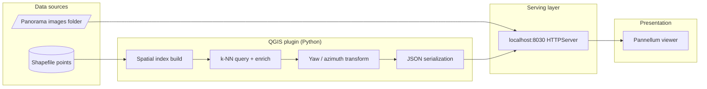

# PanoStreetView — Geospatial Imagery & Orientation Pipeline

**Interactive QGIS plugin that turns vector panorama metadata + equirectangular imagery into a local, browser-served viewing experience with correct heading (yaw) and scene navigation.**

This repository is framed as a **small end-to-end data pipeline**: spatially indexed GIS features drive runtime JSON contracts, a lightweight HTTP serving layer exposes assets and metadata, and a web client (Pannellum) consumes those contracts for visualization. It demonstrates skills that transfer directly to data engineering—**source integration, indexing for low-latency lookup, deterministic transformations, schema-like payloads, and operational glue between batch and interactive workloads**.

---

## Why this belongs in a data engineering portfolio

| Theme | How this project shows it |
|--------|---------------------------|
| **Data sources** | Vector layer (shapefile) + filesystem imagery; explicit attribute contract (`Name`, `Azimuth`). |
| **Performance** | Pre-built **spatial index** (`QgsSpatialIndex`) for nearest-neighbor queries instead of full scans. |
| **Transformations** | Map click + bearing vector → angle math → **yaw offset** vs stored azimuth; CRS handling toward WGS84 where needed. |
| **Orchestration** | QGIS UI triggers indexing, then map-tool events trigger extract → serialize → serve → open consumer. |
| **Serving layer** | Embedded **Python `HTTPServer`** with a custom handler mapping `/images/*` to the user’s image directory. |
| **Contracts** | Version-stable JSON artifacts (`azimuth_data.json`, `Image_to_copy.json`) between Python and the browser. |
| **Consumer** | Async fetch + merge in `index_view.html`, scene graph for Pannellum. |

---

## Pipeline flow (PNG — download / embed)

Static diagram for slides, LinkedIn, or README previews. **File in repo:** [`pipeline-flow-diagram.png`](pipeline-flow-diagram.png) — on GitHub, open that file and use **Download raw file** (or clone the repo and copy the PNG from the project root).


---

## Architecture at a glance



---

## Detailed pipeline flow

The following diagram mirrors the actual control flow in `PanoStreetView_2.py` and `index_view.html`.


### Sequence diagram (click → view)

```mermaid
sequenceDiagram
  participant U as User
  participant Q as QGIS / PointTool
  participant N as NearestPointFinder
  participant F as Filesystem JSON
  participant H as HTTPServer :8030
  participant B as Browser + Pannellum

  U->>Q: Click + drag bearing line
  Q->>Q: Compute angle; transform CRS as needed
  Q->>N: find_nearest_point_with_image(coords)
  N->>N: spatialIndex.nearestNeighbor(n=1)
  N-->>Q: feature id, image Name, Azimuth

  Q->>N: next_11_images(coords)
  N->>N: nearestNeighbor(n=k); sort ids
  N->>F: overwrite Image_to_copy.json

  Q->>F: overwrite azimuth_data.json
  Q->>H: Start thread; serve plugin + /images alias
  Q->>B: Open index_view.html

  B->>H: GET azimuth_data.json
  B->>H: GET Image_to_copy.json
  H-->>B: JSON payloads

  B->>B: Match index; build scenes; init viewer
  B->>H: GET /images/{point_name}
  H-->>B: Equirectangular image bytes
```

---

## Data contracts (JSON)

These files are the **interface** between the Python pipeline and the web client.

### `azimuth_data.json` (single object)

Written on each successful map interaction. Drives which panorama is “current” and how Pannellum should orient.

| Field | Type | Role |
|--------|------|------|
| `index` | int | Feature id / key aligned with shapefile lookup |
| `azimuth` | float | Stored heading from GIS attributes |
| `yaw_value` | float | Computed viewer yaw: user bearing minus azimuth |

### `Image_to_copy.json` (array)

Neighbor set for scene-to-scene navigation. Each element includes image name, azimuth, and coordinates string for traceability.

| Field | Type | Role |
|--------|------|------|
| `row` | int | Ordinal in the exported batch |
| `index` | int | Feature id |
| `point_name` | string | Filename served under `/images/` |
| `azimuth` | float | Heading metadata |
| `coordinates` | string | Lat/lon-style pair (as serialized in plugin) |

> **Note:** The helper is named `next_11_images` in code, but the spatial query uses `nearestNeighbor(..., 3)`—i.e. **k nearest neighbors** for the exported set. Update `k` if you need a wider corridor of scenes.

---

## Tech stack

- **Python 3 / PyQGIS** — vector layers, spatial index, map tools, threading  
- **`json`, `math`, `http.server`** — serialization, bearing math, embedded file server  
- **Qt (`QThread`)** — non-blocking HTTP daemon from the GIS process  
- **HTML / JS** — Pannellum 2.5.6 (CDN), `fetch`, async scene assembly  

---

## Prerequisites

- **QGIS 3.x** with Python enabled  
- **Shapefile** (or compatible OGR source) of **point** features with at least:
  - `Name` — panorama filename  
  - `Azimuth` — numeric heading in degrees  
- **Folder** of equirectangular images whose filenames match `Name`  
- **Google Chrome** at the default path in `PanoStreetView_2.py` (or adjust `chrome_path`)  

---

## How to run (high level)

1. Copy the plugin folder into your QGIS profile plugins directory (see QGIS docs for plugin paths).  
2. Enable **PanoStreetView_2** in the Plugin Manager.  
3. Open the plugin, select the **shapefile** and **images directory**, then run **index build** (progress bar).  
4. Click the map and **drag a line** indicating viewing direction; release to trigger lookup, JSON write, server start, and browser launch.  

---

## Repository layout (selected)

| Path | Purpose |
|------|---------|
| `PanoStreetView_2.py` | Plugin entry, spatial indexing, map tool, HTTP daemon, JSON writers |
| `PanoStreetView_2_dialog.py` | Configuration UI wiring |
| `index_view.html` | Client: loads JSON, builds Pannellum configuration |
| `index_error.html` | Fallback UI when imagery path is wrong |
| `azimuth_data.json` / `Image_to_copy.json` | Runtime artifacts (overwritten per interaction) |
| `metadata.txt` | QGIS plugin metadata |

---

## Honest scope & how to extend it (for interviews)

**What this is:** A focused **interactive GIS-to-web** pipeline with clear separation between **indexed spatial data**, **derived JSON contracts**, and a **minimal static asset server**.

**Credibly “data engineering” next steps** you could describe or implement:

- Promote JSON to a **document store** or **object storage** with versioning and partitions by survey/date  
- Replace ad hoc filenames with **manifest files** (e.g. Parquet sidecars for attributes + URIs)  
- Add **Airflow / Dagster** job to build the spatial index and validate schemas offline  
- Containerize the viewer + a **nginx** static layer; parameterize `chrome_path` and port  
- Unit tests for **bearing → yaw** math and **JSON schema** validation (e.g. `jsonschema`)  

---

## License

This plugin follows the **GNU General Public License v2** (or later) as indicated in the source headers. See individual files for copyright lines.

---

## Author

**Sachin Kulal** — geospatial & data-oriented tooling; portfolio piece demonstrating pipeline thinking from **source → index → transform → serve → consume**.

If you use this in applications, be ready to explain trade-offs: embedded HTTP server vs dedicated infra, shapefile vs PostGIS for production, and how you would harden schema and observability for a team environment.
