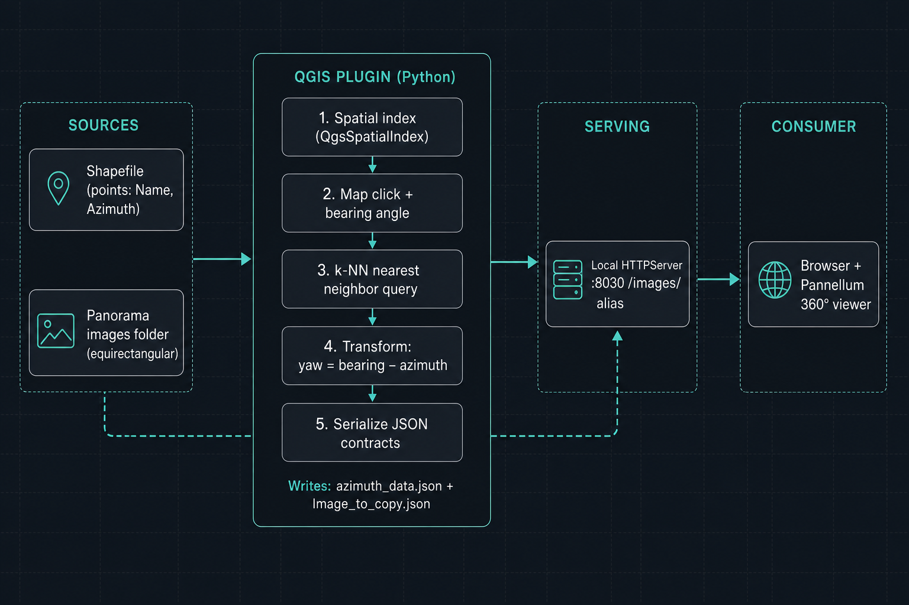
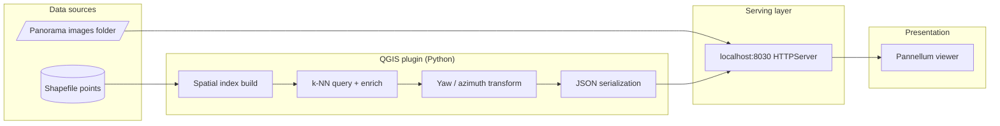
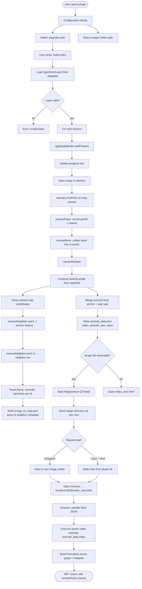

# PanoStreetView — Geospatial Imagery & Orientation Pipeline

**Interactive QGIS plugin that turns vector panorama metadata + equirectangular imagery into a local, browser-served viewing experience with correct heading (yaw) and scene navigation.**

This repository is framed as a **small end-to-end data pipeline**: spatially indexed GIS features drive runtime JSON contracts, a lightweight HTTP serving layer exposes assets and metadata, and a web client (Pannellum) consumes those contracts for visualization. It demonstrates skills that transfer directly to data engineering—**source integration, indexing for low-latency lookup, deterministic transformations, schema-like payloads, and operational glue between batch and interactive workloads**.

---

## Core Data flows

| Theme | Functionality |
|--------|---------------------------|
| **Data sources** | Vector layer (shapefile) + filesystem imagery; explicit attribute contract (`Name`, `Azimuth`). |
| **Performance** | Pre-built **spatial index** (`QgsSpatialIndex`) for nearest-neighbor queries instead of full scans. |
| **Transformations** | Map click + bearing vector → angle math → **yaw offset** vs stored azimuth; CRS handling toward WGS84 where needed. |
| **Orchestration** | QGIS UI triggers indexing, then map-tool events trigger extract → serialize → serve → open consumer. |
| **Serving layer** | Embedded **Python `HTTPServer`** with a custom handler mapping `/images/*` to the user’s image directory. |
| **Contracts** | Version-stable JSON artifacts (`azimuth_data.json`, `Image_to_copy.json`) between Python and the browser. |
| **Consumer** | Async fetch + merge in `index_view.html`, scene graph for Pannellum. |

---

## Pipeline flow

---

## Architecture at a glance

---

## Detailed pipeline flow

The following diagram mirrors the actual control flow in `PanoStreetView_2.py` and `index_view.html`.

## Prerequisites

- **QGIS 3.x** with Python enabled  
- **Shapefile** (or compatible OGR source) of **point** features with at least:
  - `Name` — panorama filename  
  - `Azimuth` — numeric heading in degrees  
- **Folder** of equirectangular images whose filenames match `Name`  
- **Google Chrome** at the default path in `PanoStreetView_2.py` (or adjust `chrome_path`)  

---

## How to Install

To install the plugin manually:

1. Download the ZIP file from this repository.
2. Open QGIS.
3. Go to: `Plugins` → `Manage and Install Plugins` → `Install from ZIP`.
4. Select the downloaded ZIP file and install it.

## Usage

To use this plugin:

1. Ensure your panoramic images are **geotagged** and stored in a folder (preferably `.JPG` in equi-rectangular projection).
2. Create or load photo points in a **shapefile** (EPSG:4326 recommended) that contains:
   - A `Name` field matching each image filename.
   - Accurate coordinates for each photo location.
   - You can use the QGIS plugin **ImportPhotos** (available in the QGIS plugin repository) to generate this layer.
---

## Output preview

## Tech stack

- **Python 3 / PyQGIS** — vector layers, spatial index, map tools, threading  
- **`json`, `math`, `http.server`** — serialization, bearing math, embedded file server  
- **Qt (`QThread`)** — non-blocking HTTP daemon from the GIS process  
- **HTML / JS** — Pannellum 2.5.6 (CDN), `fetch`, async scene assembly  

---

## Author

**Sachin Kulal** — geospatial & data-oriented | R&D
